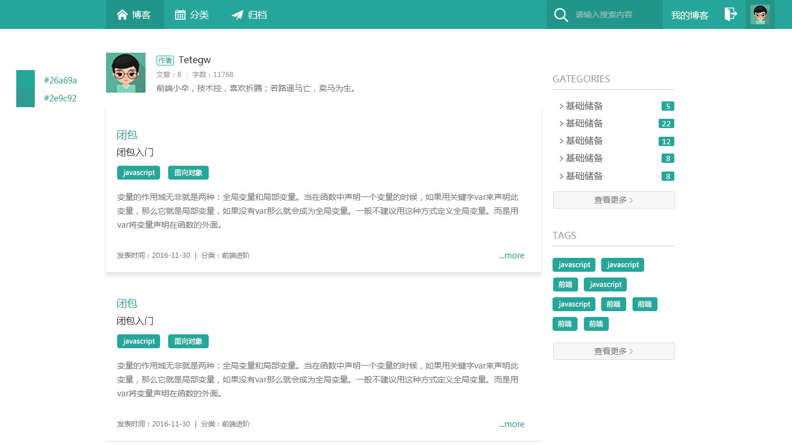
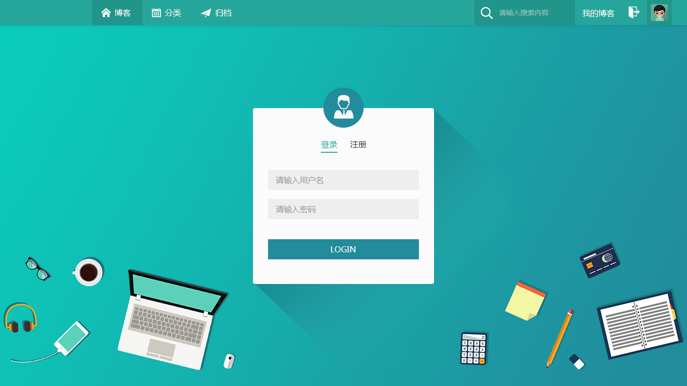
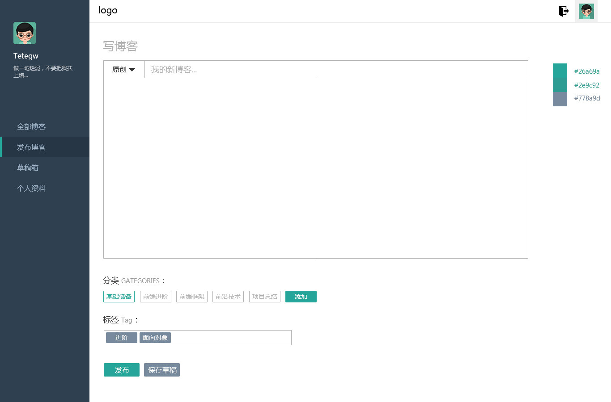
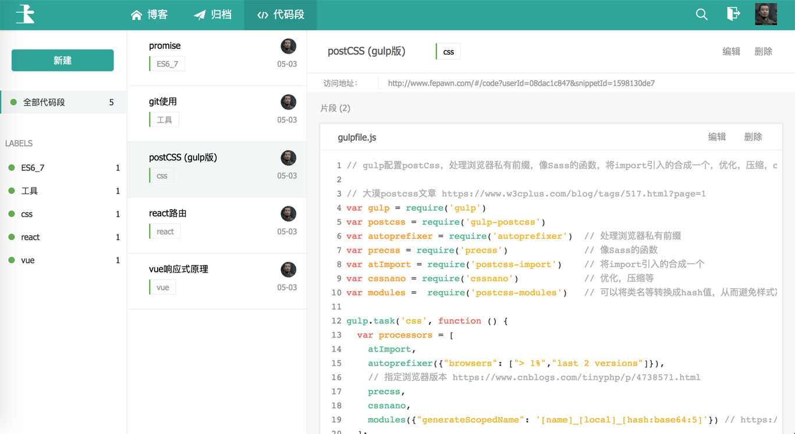

### 文章系统+代码片段管理

#### 项目简介：
一个可以注册登录的个人文章系统，包括前台博客、归档(按时间排序博客)、代码片段管理、后台管理等功能。

#### 项目目的：
一方面是为了做一个属于自己的网站，有自己想要的定制功能；另一方面也为了练练手多学习，从原型、设计到前端再到node，一步步遇到问题然后解决问题。

#### 项目技术：
前期：Vue + node + MySQL   (node部分比较简陋，可[参考](https://github.com/Tetegw/pawnBlog_nodejs))
后期：Vue + Bmob(云后台)

#### 项目效果：

